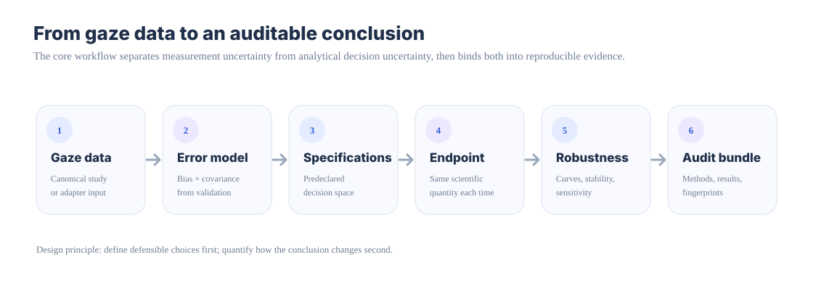

# GazeAudit

**Measurement uncertainty and inferential robustness for eye-tracking research.**

[Documentation](https://stefanosbalaskas.github.io/GazeAudit/) · [Documentation compass](https://stefanosbalaskas.github.io/GazeAudit/docs/documentation-map/) · [Data contract](https://stefanosbalaskas.github.io/GazeAudit/docs/data-contract/) · [Install](https://stefanosbalaskas.github.io/GazeAudit/docs/install/) · [Getting started](https://stefanosbalaskas.github.io/GazeAudit/docs/getting-started/) · [Examples](https://stefanosbalaskas.github.io/GazeAudit/docs/examples/) · [Workflows](https://stefanosbalaskas.github.io/GazeAudit/docs/workflows/) · [Case studies](https://stefanosbalaskas.github.io/GazeAudit/docs/case-studies/) · [PyPI](https://pypi.org/project/gazeaudit/0.1.0/) · [Zenodo DOI](https://doi.org/10.5281/zenodo.22757340)

GazeAudit is a scientific Python package built around one question:

> **Would the scientific conclusion survive other reasonable measurement and analytical choices?**

It combines two methodological layers:

1. **Measurement uncertainty** — model calibration/validation error and propagate spatial uncertainty into AOI membership and scientific endpoints instead of treating every gaze coordinate as exact.
2. **Analytical robustness** — declare defensible preprocessing, QC, detector, AOI, missing-data, sampling, and other analysis choices and quantify how the same endpoint changes across them.

GazeAudit sits **above** existing parsing, preprocessing, and event-detection ecosystems. It is not intended to replace tracker software, fixation detectors, pymovements, pEYES, or the Eye-Tracking-BIDS ecosystem.

## Install

The current public release is `0.1.0`:

```bash
python -m pip install gazeaudit==0.1.0
```

Optional interoperability extras:

```bash
python -m pip install "gazeaudit[pymovements]==0.1.0"
python -m pip install "gazeaudit[peyes]==0.1.0"  # Python 3.12+
```

The package declares Python `>=3.10`; release `0.1.0` is exercised on Python 3.10–3.13 in the repository test matrix. See the [Install & environment center](https://stefanosbalaskas.github.io/GazeAudit/docs/install/) for generated extras, console scripts, source-checkout commands, and environment verification.

## Documentation

The website is organised by research task rather than only by modules:

| If you want to… | Start here |
|---|---|
| choose whether you need a learning example, task guide, exact reference, or explanation | [Documentation compass](https://stefanosbalaskas.github.io/GazeAudit/docs/documentation-map/) |
| set up Python, choose extras, and verify the environment | [Install & environment center](https://stefanosbalaskas.github.io/GazeAudit/docs/install/) |
| map an existing gaze/fixation table into the canonical GazeStudy contract | [Data Contract & Schema Mapping Center](https://stefanosbalaskas.github.io/GazeAudit/docs/data-contract/) |
| preserve source/mapping/unit/transformation provenance | [Data mapping provenance guide](https://stefanosbalaskas.github.io/GazeAudit/docs/guides/data-mapping-provenance/) |
| interpret and triage structural-QC review flags | [Structural QC Issue Clinic](https://stefanosbalaskas.github.io/GazeAudit/docs/reference/qc-issue-clinic/) |
| declare readiness thresholds and preview cohort impact before filtering | [Readiness Policy Design Center](https://stefanosbalaskas.github.io/GazeAudit/docs/readiness-policy/) |
| translate audit evidence into bounded Methods, Results, and limitation wording | [Results Interpretation & Reporting Center](https://stefanosbalaskas.github.io/GazeAudit/docs/reporting-center/) |
| declare one common scalar endpoint before executing a specification space | [Endpoint Definition & Handoff Center](https://stefanosbalaskas.github.io/GazeAudit/docs/endpoint-contract/) |
| declare specification factors, levels, validity, timing, and failure policy | [Specification Space Declaration Center](https://stefanosbalaskas.github.io/GazeAudit/docs/specification-declaration/) |
| preserve branch failures, non-finite endpoints, not-run states, and repair/rerun lineage | [Execution Ledger & Recovery Center](https://stefanosbalaskas.github.io/GazeAudit/docs/execution-ledger/) |
| interpret specification curves, stability, sensitivity, and reproducible diagnostic plots | [Robustness Diagnostics & Sensitivity Interpretation Center](https://stefanosbalaskas.github.io/GazeAudit/docs/robustness-diagnostics/) |
| design controlled sampling and gaze-missingness perturbations without implying hardware or missingness-mechanism truth | [Sampling & Missingness Sensitivity Center](https://stefanosbalaskas.github.io/GazeAudit/docs/sampling-missingness/) |
| declare an independently justified conclusion-recovery rule without hidden scientific defaults | [Conclusion Rule Design Center](https://stefanosbalaskas.github.io/GazeAudit/docs/conclusion-rule/) |
| run the smallest uncertainty-aware AOI example | [Getting started](https://stefanosbalaskas.github.io/GazeAudit/docs/getting-started/) |
| browse worked examples by data context and methodological focus | [Example catalog](https://stefanosbalaskas.github.io/GazeAudit/docs/examples/catalog/) |
| adapt a teaching example to a real study without inheriting demonstration values | [Adapt examples to your study](https://stefanosbalaskas.github.io/GazeAudit/docs/guides/adapt-examples-to-study/) |
| model gaze-position uncertainty | [AOI uncertainty guide](https://stefanosbalaskas.github.io/GazeAudit/docs/guides/aoi-uncertainty/) |
| build a defensible analysis multiverse | [Specification-space guide](https://stefanosbalaskas.github.io/GazeAudit/docs/guides/specification-space/) |
| stress-test sampling rate | [Sampling sensitivity example](https://stefanosbalaskas.github.io/GazeAudit/docs/examples/sampling-sensitivity/) |
| design a complete uncertainty/robustness analysis | [Research workflows](https://stefanosbalaskas.github.io/GazeAudit/docs/workflows/) |
| inspect the three frozen validation cases visually | [Case studies](https://stefanosbalaskas.github.io/GazeAudit/docs/case-studies/) |
| build deterministic publication evidence | [Publication audit guide](https://stefanosbalaskas.github.io/GazeAudit/docs/guides/publication-audits/) |
| connect BIDS, pymovements, pEYES, or custom backends | [Interoperability guide](https://stefanosbalaskas.github.io/GazeAudit/docs/guides/interoperability/) |
| find the right public function | [API map](https://stefanosbalaskas.github.io/GazeAudit/docs/reference/api-map/) |
| inspect authoritative frozen validation evidence | [Validation matrix](docs/VALIDATION_MATRIX.md) |



## Quick example: uncertain AOI membership

```python
import numpy as np
import pandas as pd

from gazeaudit import (
    GaussianGazeErrorModel,
    RectangleAOI,
    aoi_probabilities,
    expected_dwell,
)

validation = pd.DataFrame(
    {
        "observed_x": [501, 500, 499, 502],
        "observed_y": [400, 399, 401, 400],
        "target_x": [500, 500, 500, 500],
        "target_y": [400, 400, 400, 400],
    }
)

error_model = GaussianGazeErrorModel.fit(validation)

aois = [
    RectangleAOI("claim", 450, 350, 500, 450),
    RectangleAOI("price", 500, 350, 550, 450),
]

fixations = np.array([[500.0, 400.0], [490.0, 405.0]])
probabilities = aoi_probabilities(
    fixations,
    aois,
    error_model,
    draws=4000,
    rng=42,
)

claim_dwell_ms = expected_dwell(
    probabilities,
    durations=np.array([180.0, 220.0]),
    aoi="claim",
)
```

A fixation near a decision boundary can therefore contribute probabilistically to an AOI endpoint instead of being reduced immediately to one deterministic label.

## Quick example: declare a specification space

```python
from gazeaudit import PipelineSpace

space = (
    PipelineSpace()
    .add_choice("detector", ["ivt", "idt"])
    .add_choice("qc", ["moderate", "strict"])
    .add_choice("aoi_mode", ["hard", "probabilistic"])
)

print(space.size)
# 8
```

`run_specs()` evaluates every valid declared specification against one common scalar endpoint. The resulting table can be summarised with `specification_curve()`, `effect_stability()`, `marginal_sensitivity()`, and `pairwise_interaction_sensitivity()`.

GazeAudit does **not** search for the pipeline that produces the most attractive result. Researchers define the scientifically defensible decision space first; the package then quantifies what those choices do to the conclusion.

## Scientific scope

The current scientific MVP includes:

- canonical vendor-neutral `GazeStudy` representation;
- rectangle and circle AOI primitives;
- global and grouped Gaussian gaze-error models;
- Monte Carlo probabilistic AOI membership;
- hard-versus-probabilistic AOI comparison, flip probability, and boundary-risk summaries;
- uncertainty-weighted dwell and fixation-count endpoints;
- declarative `PipelineSpace` specification grids;
- specification curves and descriptive effect stability;
- marginal and pairwise interaction sensitivity diagnostics;
- spatial-error, sampling-rate, and structured-missingness sensitivity analyses;
- known-truth AOI/effect recovery benchmarks;
- predeclared conclusion-recovery rules;
- deterministic provenance fingerprints and publication audit bundles;
- Eye-Tracking-BIDS ingestion;
- pymovements and pEYES interoperability;
- user-defined study and detector adapter protocols.

The first measurement-error models are deliberately transparent and assumption-bound. GazeAudit does not claim that one error model describes every tracker, participant, session, screen region, or study design.

## Frozen validation programme

The scientific MVP deliberately preserves three different real-data outcomes:

| Case study | Frozen scientific question | Canonical outcome |
|---|---|---|
| GazeBase multi-detector audit | Does the frozen detector specification space satisfy the predeclared completeness gate? | `incomplete` |
| Korthals target-tracking AOI | Does the negative paired AOI effect survive the frozen measurement-error propagation model? | `robust_negative` |
| Pedrotti/de Chambrier sampling + missingness | Does the frozen gaze-path-rate contrast recover across downsampling and added missingness? | `materially_fragile` |

These labels are protocol-bound scientific records, not generic judgments about the source datasets. Each case preserves frozen protocol/source identity, deterministic provenance, checksummed evidence, and explicit scientific decision rules. See the [visual case-study walkthroughs](https://stefanosbalaskas.github.io/GazeAudit/docs/case-studies/) for accessible explanatory plots and [`docs/VALIDATION_MATRIX.md`](docs/VALIDATION_MATRIX.md) for the authoritative provenance index.

## Interoperability

### Eye-Tracking-BIDS

```python
from gazeaudit import read_bids_eyetrack

record = read_bids_eyetrack(
    "sub-01_task-search_recording-eye1_physio.tsv.gz"
)
study = record.study
```

GazeAudit normalises supported eye-tracking records while retaining source metadata. It is not a replacement for the official BIDS Validator.

### pymovements

```python
from gazeaudit import from_pymovements_gaze

study = from_pymovements_gaze(
    gaze,
    coordinate="pixel",
    component="auto",
    participant_id="p01",
)
```

Binocular four- or six-component vectors require an explicit `left`, `right`, or `cyclopian` choice; GazeAudit does not silently choose or average an eye.

### pEYES

```python
from gazeaudit import make_peyes_detector, run_peyes_detector

ivt = make_peyes_detector(
    "ivt",
    min_event_duration=40,
    saccade_velocity_threshold=30,
)

result = run_peyes_detector(
    study,
    ivt,
    viewer_distance_cm=60,
    pixel_size_cm=0.027,
)
```

The normalised `DetectionResult` keeps sample labels separate from detector/trial metadata so detector families can be compared through one auditable contract.

## Reproducible publication

A robustness analysis can be bound to a predeclared conclusion rule and deterministic publication bundle:

```python
from gazeaudit import ConclusionRule, build_conclusion_audit_bundle

rule = ConclusionRule(
    relative_tolerance=0.20,
    require_sign=True,
    minimum_recovery_fraction=0.90,
)

bundle = build_conclusion_audit_bundle(
    results,
    reference_effect=10.0,
    rule=rule,
    title="Example conclusion-robustness audit",
    endpoint="treatment-minus-control dwell",
    source_description="Synthetic known-truth validation fixture",
)

print(bundle.scientific_fingerprint)
print(bundle.bundle_fingerprint)
print(bundle.manifest_json())
```

For real-data analyses, GazeAudit does not infer the `reference_effect`; its meaning must be independently defined and justified before robustness outputs are inspected.

## Development and scientific guardrails

The scientific MVP validation baseline is complete. Post-release development may add richer interpolation/QC multiverses, spatially varying error models, uncertainty-aware process metrics, dynamic-AOI uncertainty, richer missingness models, device-portability analyses, and additional interoperability.

Those additions do **not** retroactively alter the frozen GazeBase (`incomplete`), Korthals (`robust_negative`), or Pedrotti (`materially_fragile`) records.

## Citation

For analyses using release `0.1.0`, cite the version-specific Zenodo DOI **[10.5281/zenodo.22757340](https://doi.org/10.5281/zenodo.22757340)** and record the exact software version or commit used.

The concept DOI **[10.5281/zenodo.22757339](https://doi.org/10.5281/zenodo.22757339)** represents all Zenodo versions and resolves to the latest archived version.

Citation metadata are provided in [`CITATION.cff`](CITATION.cff). External publication provenance is recorded in [`release/0.1.0-external-publication-verification.json`](release/0.1.0-external-publication-verification.json).

## License

MIT.

## Development documentation on `main`

Post-release development now includes provenance-bound analysis-readiness governance and a [code-generated plot gallery](https://stefanosbalaskas.github.io/GazeAudit/docs/plots/) covering QC, cohort impact, repairs, specification curves, sensitivity, AOI geometry, and recovery diagnostics. These additions do not alter the frozen v0.1.0 scientific outcomes.
